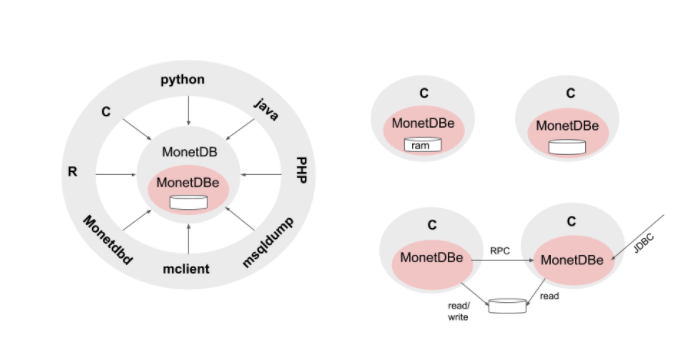

Introduction
============

``MonetDBe`` is the embedded version of MonetDB. It provides all the
functionality offered by the MonetDB SQL server environment, but makes
this available as a single ``libmonetdbe.so`` library. This library
can be directly linked with a C application to benefit from the
functionality.

``An embedded database system is a database management system (DBMS) which
is tightly integrated with an application software that requires access to stored data,
such that the database system is "hidden" from the application's end-user
and requires little or no ongoing maintenance.`` `wikipedia <https://en.wikipedia.org/wiki/Embedded_database>`

The embedded database market has for a long time been dominated by traditional row-stores,
often with limited SQL functionality, scalability or performance.
The space lacks a mature open-source column store deemed essential to push
the performance envelope for data analytics applications.

What is our proposed solution?
------------------------------

Wouldn't it be great if a full fledged column-store SQL database server be harnessed
to the point it can work as an embedded DBMS.  A fully parallel execution engine
to exploit the common multi-core platforms. This way addressing the needs for
data analytics and machine learning, without relying on expensive interprocess communication or ETL.
A strong embeddedness with the application to easily use the UDFs at close range without overhead in data exchanges.

How we solved it
----------------

The solution brought to you is illustrated below. On the left we see MonetDB in
the role of a client/server architecture as it has worked all along.
The interaction between the applications and the server is regulated using standard API's, such as JDBC/ODBC, and the MonetDB API.
In this architecture, the underlying assumptions are:
. The server is fully isolated from the application code for security, stability, reliability.
. The server serves multiple users concurrently.
. The server manages a large shared storage space.
. The server can use replication for resilience and load sharing.
. The server can communicate with its peers to execute queries over partitioned tables.

A large part of the server code, however, can be decoupled to reach an
embeddable database system, illustrated at the right with a focus
on the programming language C.
A single library to be linked into the application code directly. With the obvious benefits:

. No client-server communication overhead.
. No intermediate serialization.
. Full use of the multi-core architectures.
. Seamless integration with the application.
. Single user control over the resources.
. Working with :memory: databases with controlled RAM footprint.
. Boosting your data analytics

How does it work?
-----------------

MonetDBe encapsulates the full SQL functionality offered by MonetDB.
To achieve this, we had to create a single shared library (libmonetdbe) to
expose the main sql interfaces using a small api (monetdbe.h).
It is an integral component of the server version nowadays, which avoids maintaining multiple code paths.

What to expect?
---------------

The MonetDBe library supports three different storage schemes.
A light-weight scheme for small databases confined to main memory, i.e. connect(':memory:').
The maximum footprint can be set explicitly or is derived from the host (VM) resource limits.
Using a directory on your local machine is the way to go if you need persistence,
but with exclusive access as it concerns ACID properties. If the application works
with :memory: or a local database then switching to a MonetDB server merely
requires the connect call to be provided with the access point information.

The MonetDBe code is available from the development branch of MonetDB as an **alpha-release**..
For now, the embedded version can serve a single database at a time, but coarse grain locking
is considered to enable sharing the same persistent storage.
There is no such thing as distributed queries over partitioned tables and
stored in different MonetDBe instances or instant database replication between them.
These features we will be added to the interface soon.

